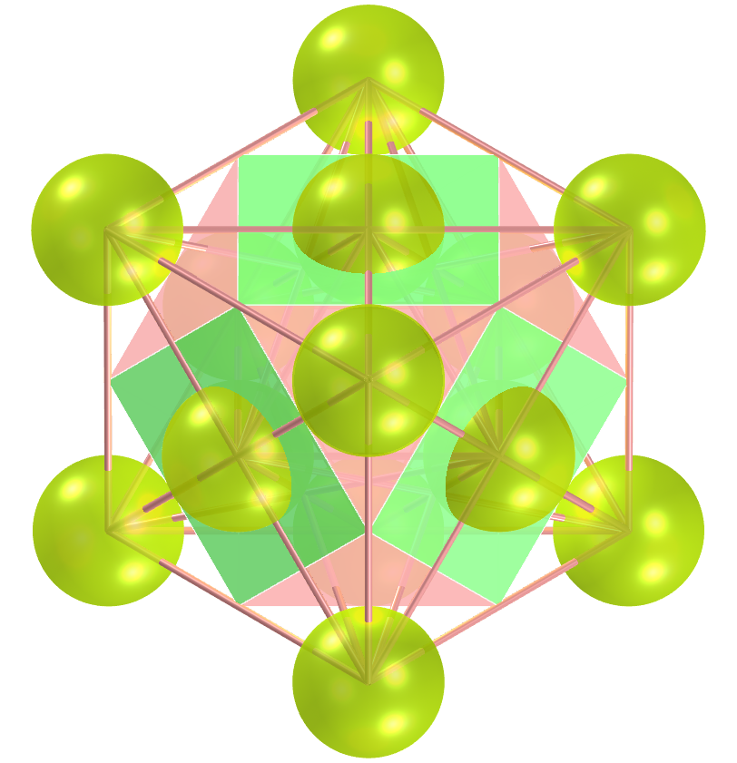
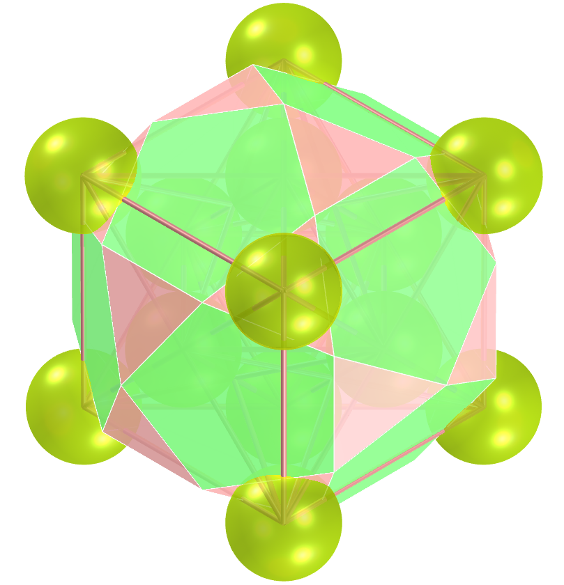
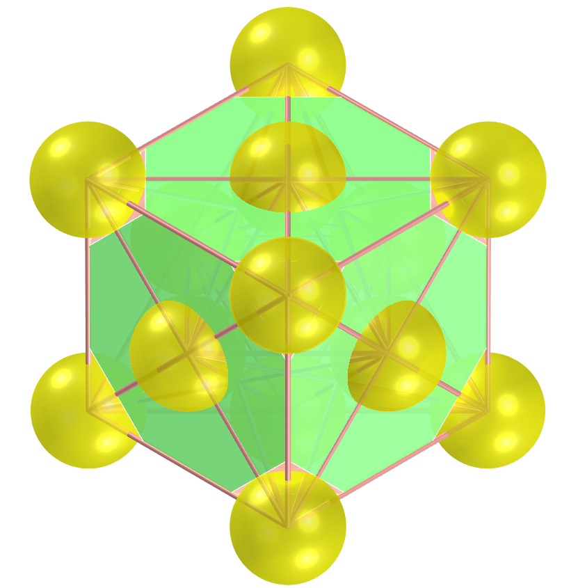
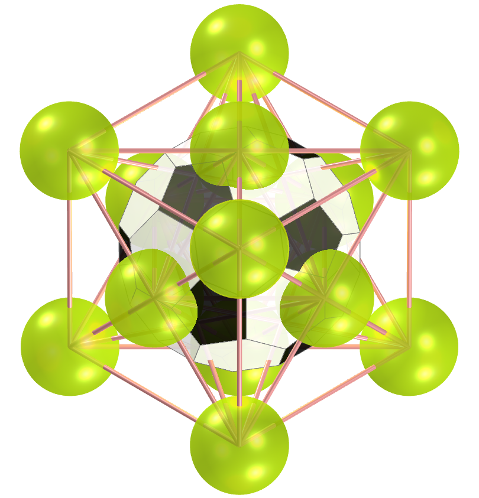
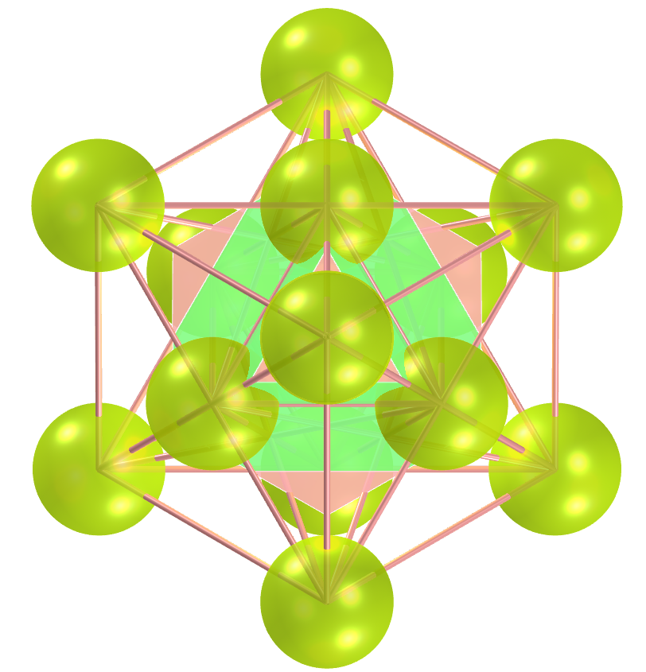

<link rel="stylesheet" href="../../scripts/style.css">
<meta charset="utf-8">
<link rel="icon" type="image/png" href="../vr/salas/imagens/icone.png">
<h2>Visualização de poliedros no símbolo Cubo de Metatron com Realidade Aumentada (RA) e Realidade Virtual (RV) em A-frame</h2>
<b>autor:</b> Paulo Henrique Siqueira - Universidade Federal do Paraná
 <b>contato:</b> <a href="#"> paulohscwb@gmail.com </a>
 <a href="https://paulohscwb.github.io/metatron/archimedes/">english version</a>
<form style="margin: 0 auto; float:right; text-align:right; width:100%; margin-bottom:15px;">
	<select id="url" onchange="urlHandler(this.value)" style="color:royalblue;">
		<option disabled selected>Mais símbolos:</option>
		<option disabled value="../../catalan/pt-br/">Poliedros de Catalan</option>
		<option value="../../archimedes/pt-br/">Poliedros de Arquimedes</option>
		<!--<option value="../../biscribed/pt-br/">Poliedros biscritos</option>
		<option value="../../joined/pt-br/">Cascos convexos de Arquimedes e de Catalan</option>
		<option value="../../nonconvex/pt-br/">Poliedros não convexos 1</option>
		<option value="../../nonconvex2/pt-br/">Poliedros não convexos 2</option>
		<option value="../../propellor/pt-br/">Poliedros de hélice</option>
		<option value="../../toroids/pt-br/">Toroides poliédricos</option>-->
	</select>
</form>

  <h2 align="center"> Cubo de Metatron e os poliedros de Arquimedes</h2>
  O Cubo de Metatron é uma estrutura complexa da Geometria Sagrada, derivada da estrutura da Flor da Vida. Seu nome é uma homenagem ao Arcanjo Metatron. O símbolo Metatron aparece na tradição judaica, no islamismo e na tradição cristã. Este símbolo é considerado responsável por toda a criação e é considerado um Arcanjo, bem como um juiz.
 Este trabalho mostra poliedros de Arquimedes inscritos ou circunscritos no símbolo Cubo de Metatron, com as visualizações que podem ser acessadas com os recursos de Realidade Aumentada e também em salas imersivas de Realidade Virtual.
 
<a href="#ra">Realidade Aumentada</a>&nbsp;&nbsp;|&nbsp;&nbsp;<a href="#m3d">Modelos 3D</a>&nbsp;&nbsp;|&nbsp;&nbsp;<a href="../../pt-br/">Página Inicial</a>

 <h3 align="center">Sala imersiva</h3>
  
<iframe width="100%" src="../sala.htm" title="Sala Imersiva dos poliedros de Arquimedes" frameborder="0" loading="lazy"></iframe>

  
<a href="../sala.htm" target="_blank">&#x1f517; room link</a>
 
  

  <h3 id="ra" align="center">Realidade Aumentada</h3>
  Para visualizar os símbolos da Geometria Sagrada em RA, visite as páginas indicadas nos modelos 3D dos sólidos utilizando qualquer navegador com um dispositivo de webcam (smartphone, tablet ou notebook).
 O acesso às páginas de RV é feito clicando no círculo azul que aparece em cima de cada marcador.

<h3 id="m3d" align="center">Modelos 3D</h3>
<!--<iframe width="560" height="315" style="max-width:100%" src="https://www.youtube.com/embed/videoseries?list=PLy0I_lGW8HxVPJITr-G8ErteKw8a-iN7x" title="YouTube video player" frameborder="0" allow="accelerometer; autoplay; clipboard-write; encrypted-media; gyroscope; picture-in-picture; web-share" allowfullscreen></iframe>-->
<h4>1. Cuboctaedro</h4>

    O Cubo de Metatron é o nome dado a uma figura geométrica bidimensional complexa feita com 13 círculos do mesmo tamanho, com linhas que se estendem do centro de cada círculo ao centro de todos os outros doze círculos. Um cuboctaedro pode ser inscrito no símbolo Cubo de Metatron.
    

<h4>2. Icosidodecaedro</h4>

    O Cubo de Metatron é considerado uma variante geométrica do símbolo do Fruto da Vida que é, por sua vez, derivado do símbolo da Flor da Vida. Um icosidodecaedro pode ser circunscrito no símbolo Cubo de Metatron.
    

<h4>3. Rombicuboctaedro</h4>

    O Cubo de Metatron é um poderoso símbolo da Geometria Sagrada, pois acredita-se que este símbolo contém todos os padrões da criação. Um rombicuboctaedro pode ser inscrito no símbolo Cubo de Metatron.
    

<h4>4. Cubo Snub</h4>

    O Cubo de Metatron é o nome dado a uma figura geométrica bidimensional complexa feita com 13 círculos do mesmo tamanho, com linhas que se estendem do centro de cada círculo ao centro de todos os outros doze círculos. Um cubo snub pode ser inscrito no símbolo Cubo de Metatron.
    

<h4>5. Cubo Truncado</h4>

    O Cubo de Metatron é considerado uma variante geométrica do símbolo do Fruto da Vida que é, por sua vez, derivado do símbolo da Flor da Vida. Um cubo truncado pode ser inscrito no símbolo Cubo de Metatron.
    

<h4>6. Cuboctaedro Truncado</h4>

    O Cubo de Metatron é um poderoso símbolo da Geometria Sagrada, pois acredita-se que este símbolo contém todos os padrões da criação. Um cuboctaedro truncado pode ser inscrito no símbolo Cubo de Metatron.
    

<h4>7. Dodecaedro Truncado</h4>

    O Cubo de Metatron é o nome dado a uma figura geométrica bidimensional complexa feita com 13 círculos do mesmo tamanho, com linhas que se estendem do centro de cada círculo ao centro de todos os outros doze círculos. Um dodecaedro truncado pode ser circunscrito no símbolo Cubo de Metatron.
    

<h4>8. Icosaedro Truncado</h4>

    O Cubo de Metatron é considerado uma variante geométrica do símbolo do Fruto da Vida que é, por sua vez, derivado do símbolo da Flor da Vida. Um icosaedro truncado pode ser inscrito no símbolo Cubo de Metatron.
    

<h4>9. Octaedro Truncado</h4>

    O Cubo de Metatron é um poderoso símbolo da Geometria Sagrada, pois acredita-se que este símbolo contém todos os padrões da criação. Um Octaedro Truncado pode ser inscrito no símbolo Cubo de Metatron.
    

<h4>10. Tetraedro Truncado</h4>

    O Cubo de Metatron é o nome dado a uma figura geométrica bidimensional complexa feita com 13 círculos do mesmo tamanho, com linhas que se estendem do centro de cada círculo ao centro de todos os outros doze círculos. Um tetraedro truncado pode ser inscrito no símbolo Cubo de Metatron.
    

<h4>11. Tetraedro Truncado Estrelado</h4>

    O Cubo de Metatron é o nome dado a uma figura geométrica bidimensional complexa feita com 13 círculos do mesmo tamanho, com linhas que se estendem do centro de cada círculo ao centro de todos os outros doze círculos. Um tetraedro truncado estrelado pode ser inscrito no símbolo Cubo de Metatron.
    

<a href="#p1" class="topo">voltar ao topo</a>

  Metatron's cube and the Archimedean polyhedra: Visualization of symbols with Augmented Reality and Virtual Reality de <a xmlns:cc="http://creativecommons.org/ns#" href="https://paulohscwb.github.io/metatron/archimedes/pt-br/" property="cc:attributionName" rel="cc:attributionURL">Paulo Henrique Siqueira</a> está licenciado com uma Licença <a rel="license" href="http://creativecommons.org/licenses/by-nc-nd/4.0/">Creative Commons Atribuição-NãoComercial-SemDerivações 4.0 Internacional</a>.

<h4>Como citar este trabalho:</h4> 

Siqueira, P.H., "Metatron's cube and the Archimedean polyhedra: Visualization of symbols with Augmented Reality and Virtual Reality". Disponível em: <https://paulohscwb.github.io/metatron/archimedes/pt-br/>, Agosto de 2025.

<!---->
  <b>Referências:</b>
 Pardesco. "Sacred Geometry Art, Symbols & Meanings". <a href="https://pardesco.com/blogs/news/sacred-geometry-art-symbols-meanings" target="_blank">https://pardesco.com/blogs/news/sacred-geometry-art-symbols-meanings</a>
 Weisstein, Eric W. "Polyhedra" From MathWorld-A Wolfram Web Resource. <a href="https://mathworld.wolfram.com/topics/Polyhedra.html" target="_blank">https://mathworld.wolfram.com/topics/Polyhedra.html</a>
 Wikipedia <a href="https://en.wikipedia.org/wiki/en.wikipedia.org/wiki/Platonic_solid" target="_blank">https://en.wikipedia.org/wiki/Platonic_solid</a>
 Solar System Scope. "Solar Textures: Stars and Milky Way". <a href="http://dmccooey.com/polyhedra/" target="_blank">https://www.solarsystemscope.com/textures/</a>
