<link rel="stylesheet" href="../scripts/style.css">
<meta charset="utf-8">
<link rel="icon" type="image/png" href="vr/salas/imagens/icone.png">
<h2>Visualization of polyhedra in Metatron's cube symbol with Augmented Reality (AR) and Virtual Reality (VR) in A-frame</h2>
 <b>author:</b> Paulo Henrique Siqueira - Universidade Federal do Paraná
  <b>contact:</b> <a href="#">paulohscwb@gmail.com</a>
  <a href="https://paulohscwb.github.io/metatron/catalan/pt-br/">versão em português</a>
 <form style="margin: 0 auto; float:right; text-align:right; width:100%; margin-bottom:15px;">
	<select id="url" onchange="urlHandler(this.value)" style="color:royalblue;">
		<option disabled selected value>More symbols:</option>
		<option disabled value="../catalan/">Catalan polyhedra</option>
		<option value="../archimedes/">Archimedean polyhedra</option>
		<option value="../nonconvex/">Nonconvex polyhedra 1</option>
		<!--<option value="../biscribed/">Biscribed polyhedr</option>
		<option value="../joined/">Archimedean and Catalan convex hulls</option>
		<option value="../nonconvex2/">Nonconvex polyhedra 2</option>
		<option value="../propellor/">Propellor polyhedra</option>
		<option value="../toroids/">Polyhedral toroids</option>-->
	</select>
</form>

  <h2 align="center">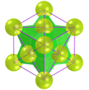 Metatron's cube and the Catalan polyhedra</h2>
Metatron's Cube is a complex structure of Sacred Geometry, derived from the structure of the Flower of Life. It is named after Archangel Metatron. The Metatron symbol appears in Jewish, Islamic and Christian tradition. This symbol is considered responsible for all creation and is considered an Archangel as well as a judge. 
 This work shows Archimedean polyhedra inscribed or circumscribed in the symbol of Metatron's cube, with views that can be accessed with Augmented Reality resources and also in immersive Virtual Reality rooms.

<a href="#ra">Augmented Reality</a>&nbsp;&nbsp;|&nbsp;&nbsp;<a href="#m3d">3D Models</a>&nbsp;&nbsp;|&nbsp;&nbsp;<a href="../">Home</a>

  

 <h3 align="center">Immersive room</h3>
  
<iframe width="100%" src="sala.htm" title="Sala Imersiva dos poliedros de Catalan" frameborder="0" loading="lazy"></iframe>

  
<a href="sala.htm" target="_blank">&#x1f517; room link</a>
 
  

  <h3 id="ra" align="center">Augmented Reality</h3>
  To view Sacred Geometry symbols in AR, simply visit the pages indicated in the 3D solid models using any browser with a webcam device (smartphone, tablet or notebook).
 Access to the VR pages is done by clicking on the blue circle that appears on top of the marker.

<h3 id="m3d" align="center">3D models</h3>
<iframe width="560" height="315" style="max-width:100%" src="https://www.youtube.com/embed/videoseries?list=PLy0I_lGW8HxVPJITr-G8ErteKw8a-iN7x" title="YouTube video player" frameborder="0" allow="accelerometer; autoplay; clipboard-write; encrypted-media; gyroscope; picture-in-picture; web-share" allowfullscreen></iframe>
<h4>1. Deltoidal hexecontahedron</h4>
<a href="vr/Metatron_DeltoidalHexecontahedron.htm" target="_blank" title="3D model" class="fotoA">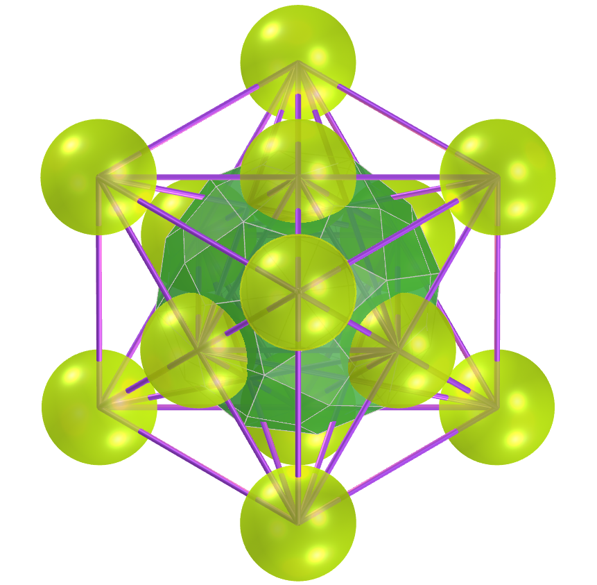</a>
    Metatron's Cube is the name given to a complex two-dimensional geometric figure made of 13 circles of equal size, with lines extending from the center of each circle to the center of all twelve other circles. A deltoidal hexecontahedron can be inscribed in Metatron's cube symbol.
   
  
 

<h4>2. Deltoidal icositetrahedron</h4>
<a href="vr/Metatron_DeltoidalIcositetrahedron.htm" target="_blank" title="3D model" class="fotoA">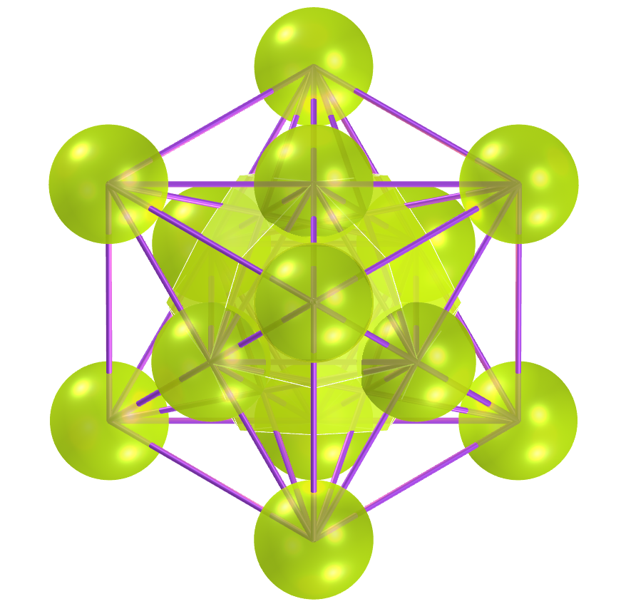</a>
    Metatron's Cube is considered a geometric variation of the Fruit of Life symbol, which is in turn derived from the Flower of Life symbol. A deltoidal icositetrahedron can be inscribed in Metatron's cube symbol.
   
 

<h4>3. Disdyakis dodecahedron</h4>
<a href="vr/Metatron_DisdyakisDodecahedron.htm" target="_blank" title="3D model" class="fotoA">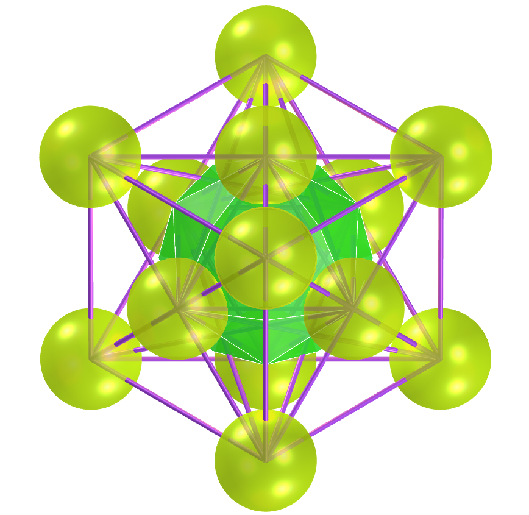</a>
    Metatron's Cube is a powerful symbol of Sacred Geometry, as this symbol is believed to contain all the patterns of creation. A disdyakis dodecahedron can be inscribed in Metatron's cube symbol.
   
 
 

<h4>4. Disdyakis triacontahedron</h4>
<a href="vr/Metatron_DisdyakisTriacontahedron.htm" target="_blank" title="3D model" class="fotoA">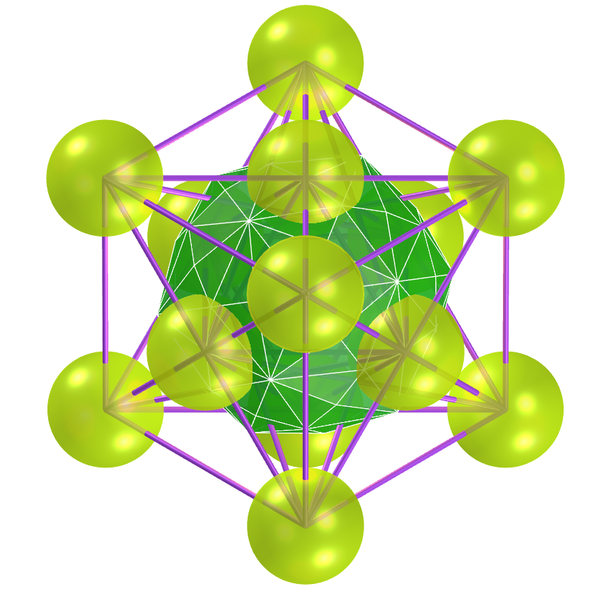</a>
    Metatron's Cube is the name given to a complex two-dimensional geometric figure made of 13 circles of equal size, with lines extending from the center of each circle to the center of all twelve other circles. A disdyakis triacontahedron can be inscribed in Metatron's cube symbol.
   
 

<h4>5. Pentagonal icositetrahedron</h4>
<a href="vr/Metatron_PentagonalIcositetrahedron.htm" target="_blank" title="3D model" class="fotoA">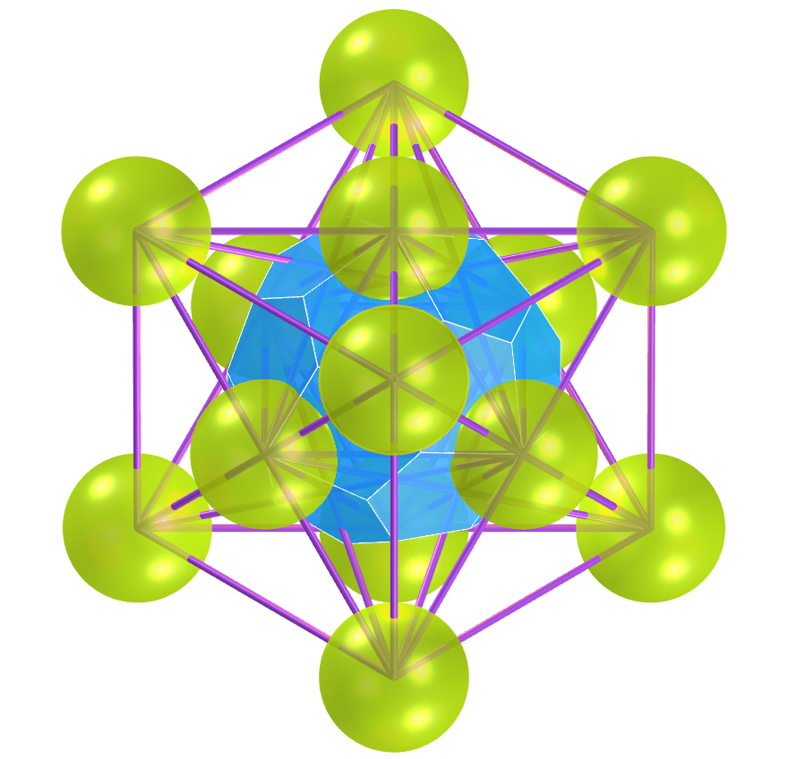</a>
    Metatron's Cube is considered a geometric variation of the Fruit of Life symbol, which is in turn derived from the Flower of Life symbol. A pentagonal icositetrahedron can be inscribed in Metatron's cube symbol.
   
  
 

<h4>6. Rhombic dodecahedron</h4>
<a href="vr/Metatron_RhombicDodecahedron.htm" target="_blank" title="3D model" class="fotoA">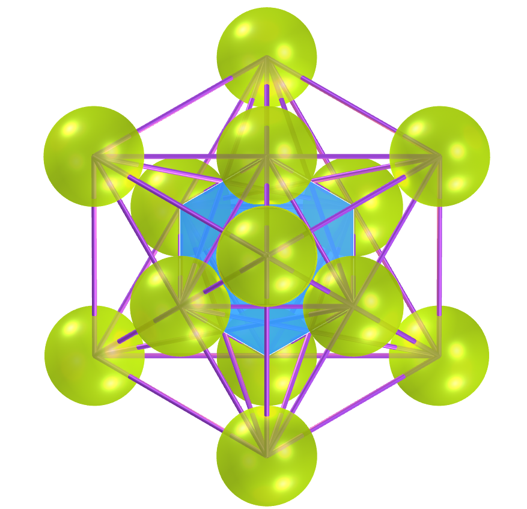</a>
    Metatron's Cube is a powerful symbol of Sacred Geometry, as this symbol is believed to contain all the patterns of creation. A rhombic dodecahedron can be inscribed in Metatron's cube symbol.
   
 
 

<h4>7. Tetrakis hexahedron</h4>
<a href="vr/Metatron_TetrakisHexahedron.htm" target="_blank" title="3D model" class="fotoA">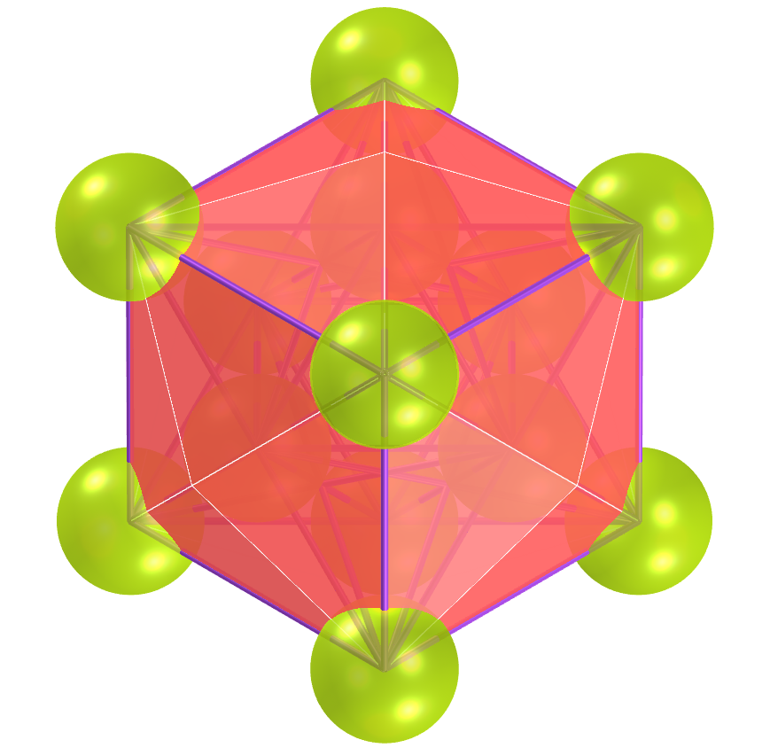</a>
    Metatron's Cube is the name given to a complex two-dimensional geometric figure made of 13 circles of equal size, with lines extending from the center of each circle to the center of all twelve other circles. A tetrakis hexahedron can be circumscribed in Metatron's cube symbol.
   
  
 

<h4>8. Triakis octahedron</h4>
<a href="vr/Metatron_TriakisOctahedron.htm" target="_blank" title="3D model" class="fotoA">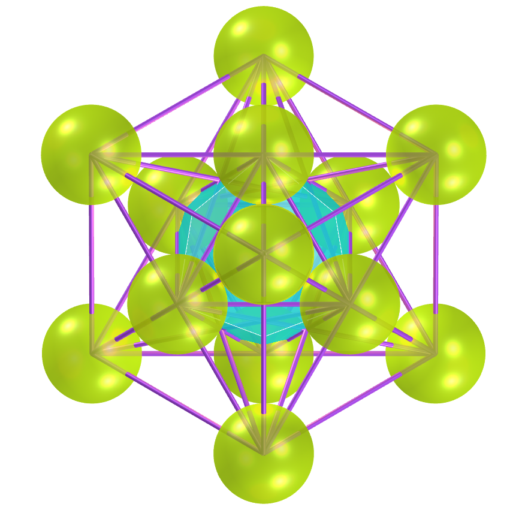</a>
    Metatron's Cube is considered a geometric variation of the Fruit of Life symbol, which is in turn derived from the Flower of Life symbol. A triakis octahedron can be inscribed in Metatron's cube symbol.
   
 
 

<h4>9. Triakis tetrahedron</h4>
<a href="vr/Metatron_TriakisTetrahedron.htm" target="_blank" title="3D model" class="fotoA">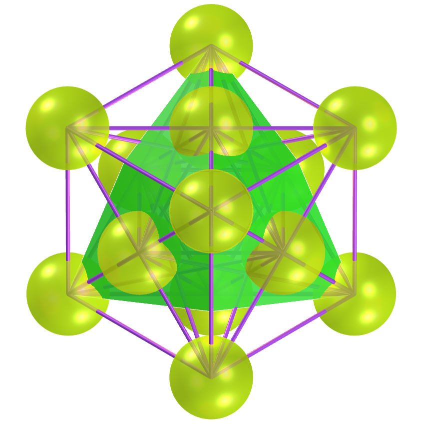</a>
    Metatron's Cube is a powerful symbol of Sacred Geometry, as this symbol is believed to contain all the patterns of creation. A triakis tetrahedron can be inscribed in Metatron's cube symbol.
   
 
 

<h4>10. Triakis stellated tetrahedron</h4>
<a href="vr/Metatron_TriakisTetrahedronStar.htm" target="_blank" title="3D model" class="fotoA">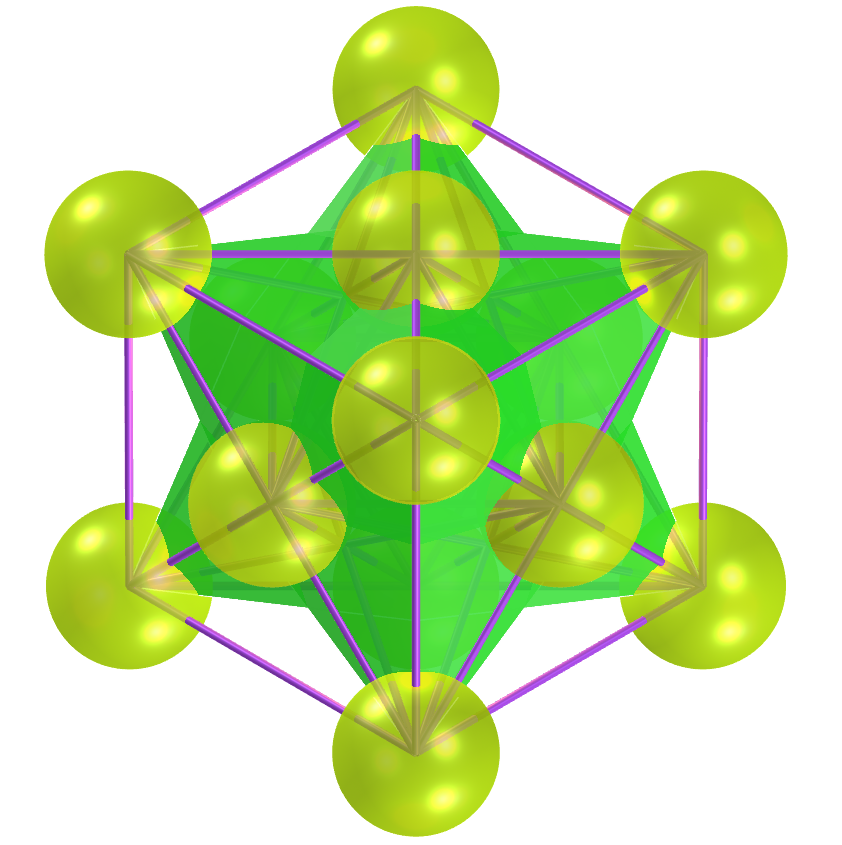</a>
    Metatron's Cube is the name given to a complex two-dimensional geometric figure made of 13 circles of equal size, with lines extending from the center of each circle to the center of all twelve other circles. A triakis stellated tetrahedron can be inscribed in Metatron's cube symbol.
   
 
 
<a href="#p1" class="topo">back to top</a>

  Metatron's cube and the Catalan polyhedra: Visualization of symbols with Augmented Reality and Virtual Reality" by <a xmlns:cc="http://creativecommons.org/ns#" href="https://paulohscwb.github.io/metatron/catalan/" property="cc:attributionName" rel="cc:attributionURL">Paulo Henrique Siqueira</a> is licensed with a license <a rel="license" href="http://creativecommons.org/licenses/by-nc-nd/4.0/">Creative Commons Attribution-NonCommercial-NoDerivatives 4.0 International</a>.

<h4>How to cite this work:</h4> 

Siqueira, P.H., "Metatron's cube and the Catalan polyhedra: Visualization of symbols with Augmented Reality and Virtual Reality". Available in: <https://paulohscwb.github.io/metatron/catalan/>, March 2025.

<!---->
  <b>References:</b>
 Pardesco. "Sacred Geometry Art, Symbols & Meanings". <a href="https://pardesco.com/blogs/news/sacred-geometry-art-symbols-meanings" target="_blank">https://pardesco.com/blogs/news/sacred-geometry-art-symbols-meanings</a>
 Weisstein, Eric W. "Polyhedra" From MathWorld-A Wolfram Web Resource. <a href="https://mathworld.wolfram.com/topics/Polyhedra.html" target="_blank">https://mathworld.wolfram.com/topics/Polyhedra.html</a>
 Wikipedia <a href="https://en.wikipedia.org/wiki/en.wikipedia.org/wiki/Platonic_solid" target="_blank">https://en.wikipedia.org/wiki/Platonic_solid</a>
 Solar System Scope. "Solar Textures: Stars and Milky Way". <a href="http://dmccooey.com/polyhedra/" target="_blank">https://www.solarsystemscope.com/textures/</a>
