<link rel="stylesheet" href="../../scripts/style.css">
<meta charset="utf-8">
<link rel="icon" type="image/png" href="../vr/salas/imagens/icone.png">
<h2>Visualização de poliedros no símbolo Cubo de Metatron com Realidade Aumentada (RA) e Realidade Virtual (RV) em A-frame</h2>
<b>autor:</b> Paulo Henrique Siqueira - Universidade Federal do Paraná
 <b>contato:</b> <a href="#"> paulohscwb@gmail.com </a>
 <a href="https://paulohscwb.github.io/metatron/nonconvex/">english version</a>
<form style="margin: 0 auto; float:right; text-align:right; width:100%; margin-bottom:15px;">
	<select id="url" onchange="urlHandler(this.value)" style="color:royalblue;">
		<option disabled selected>Mais símbolos:</option>
		<option value="../../catalan/pt-br/">Poliedros de Catalan</option>
		<option value="../../archimedes/pt-br/">Poliedros de Arquimedes</option>
		<option disabled value="../../nonconvex/pt-br/">Poliedros não convexos 1</option>
		<!--<option value="../../biscribed/pt-br/">Poliedros biscritos</option>
		<option value="../../joined/pt-br/">Cascos convexos de Arquimedes e de Catalan</option>
		<option value="../../nonconvex2/pt-br/">Poliedros não convexos 2</option>
		<option value="../../propellor/pt-br/">Poliedros de hélice</option>
		<option value="../../toroids/pt-br/">Toroides poliédricos</option>-->
	</select>
</form>

  <h2 align="center">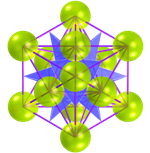 Cubo de Metatron e os poliedros não convexos 1</h2>
  O Cubo de Metatron é uma estrutura complexa da Geometria Sagrada, derivada da estrutura da Flor da Vida. Seu nome é uma homenagem ao Arcanjo Metatron. O símbolo Metatron aparece na tradição judaica, no islamismo e na tradição cristã. Este símbolo é considerado responsável por toda a criação e é considerado um Arcanjo, bem como um juiz.
 Este trabalho mostra poliedros não convexos inscritos no símbolo Cubo de Metatron, com as visualizações que podem ser acessadas com os recursos de Realidade Aumentada e também em salas imersivas de Realidade Virtual.
 
<a href="#ra">Realidade Aumentada</a>&nbsp;&nbsp;|&nbsp;&nbsp;<a href="#m3d">Modelos 3D</a>&nbsp;&nbsp;|&nbsp;&nbsp;<a href="../../pt-br/">Página Inicial</a>

 <h3 align="center">Sala imersiva</h3>
  
<iframe width="100%" src="../sala1.htm" title="Sala Imersiva dos poliedros não convexos" frameborder="0" loading="lazy"></iframe>

  

 
  
<a href="../sala1.htm" target="_blank">&#x1f517; sala 1</a>&nbsp;&nbsp;|&nbsp;&nbsp;<a href="../sala2.htm" target="_blank">&#x1f517; sala 2</a>
 
  

  <h3 id="ra" align="center">Realidade Aumentada</h3>
  Para visualizar os símbolos da Geometria Sagrada em RA, visite as páginas indicadas nos modelos 3D dos sólidos utilizando qualquer navegador com um dispositivo de webcam (smartphone, tablet ou notebook).
 O acesso às páginas de RV é feito clicando no círculo azul que aparece em cima de cada marcador.

<h3 id="m3d" align="center">Modelos 3D</h3>
<iframe width="560" height="315" style="max-width:100%" src="https://www.youtube.com/embed/videoseries?list=PLy0I_lGW8HxVxLhLxKcyWNRGW3KXoN1eN" title="YouTube video player" frameborder="0" allow="accelerometer; autoplay; clipboard-write; encrypted-media; gyroscope; picture-in-picture; web-share" allowfullscreen></iframe>
<h4>1. Dodecaedro côncavo</h4>
<a href="../vr/ConcaveDodecahedron.htm" target="_blank" title="modelo 3D" class="fotoA">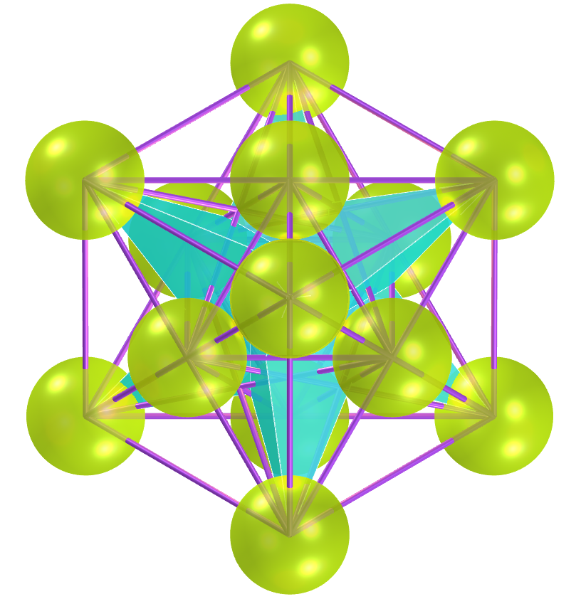</a>
    O Cubo de Metatron é o nome dado a uma figura geométrica bidimensional complexa feita com 13 círculos do mesmo tamanho, com linhas que se estendem do centro de cada círculo ao centro de todos os outros doze círculos. Um dodecaedro côncavo pode ser inscrito no símbolo Cubo de Metatron.
    

<h4>2. Cuboctaedro cubitruncado</h4>
<a href="../vr/CubitruncatedCuboctahedron.htm" target="_blank" title="modelo 3D" class="fotoA">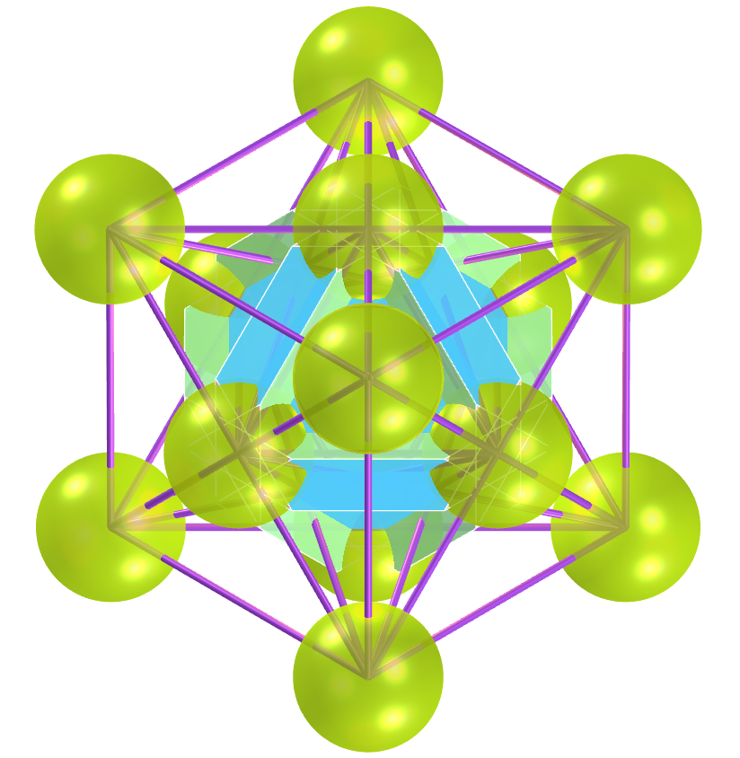</a>
    O Cubo de Metatron é considerado uma variante geométrica do símbolo do Fruto da Vida que é, por sua vez, derivado do símbolo da Flor da Vida. Um cuboctaedro cubitruncado pode ser inscrito no símbolo Cubo de Metatron.
    

<h4>3. Cubo de pipas</h4>
<a href="../vr/cubo_kites.html" target="_blank" title="modelo 3D" class="fotoA">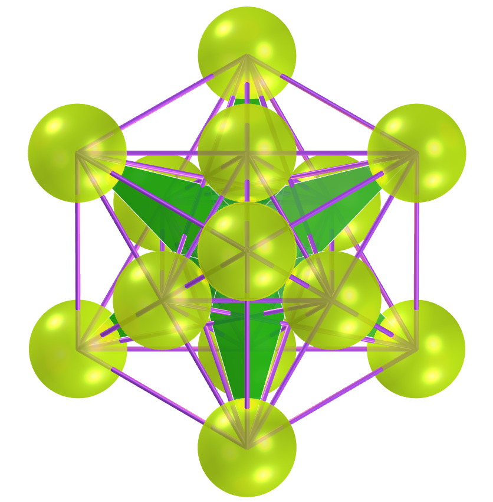</a>
    O Cubo de Metatron é um poderoso símbolo da Geometria Sagrada, pois acredita-se que este símbolo contém todos os padrões da criação. Um cubo de pipas pode ser inscrito no símbolo Cubo de Metatron.
    

<h4>4. Cubohemioctaedro</h4>
<a href="../vr/Cubohemioctahedron.htm" target="_blank" title="modelo 3D" class="fotoA">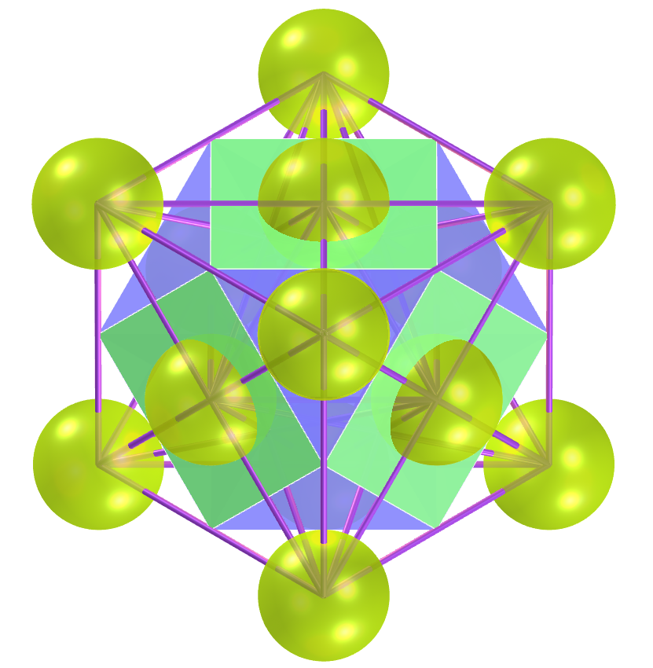</a>
    O Cubo de Metatron é o nome dado a uma figura geométrica bidimensional complexa feita com 13 círculos do mesmo tamanho, com linhas que se estendem do centro de cada círculo ao centro de todos os outros doze círculos. Um cubohemioctaedro pode ser inscrito no símbolo Cubo de Metatron.
    

<h4>5. Dodecadodecaedro ditrigonal</h4>
<a href="../vr/DitrigonalDodecadodecahedron.htm" target="_blank" title="modelo 3D" class="fotoA">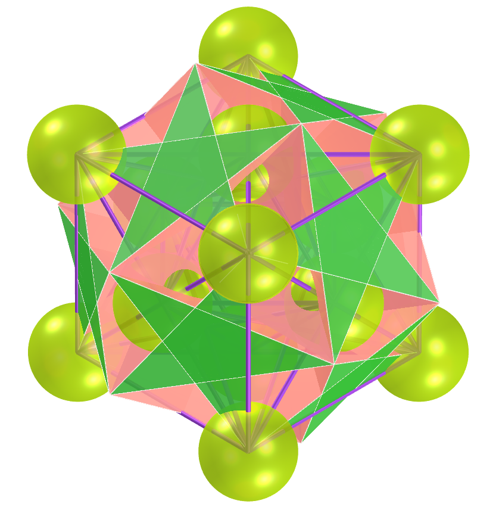</a>
    O Cubo de Metatron é considerado uma variante geométrica do símbolo do Fruto da Vida que é, por sua vez, derivado do símbolo da Flor da Vida. Um dodecadodecaedro ditrigonal pode ser inscrito no símbolo Cubo de Metatron.
    

<h4>6. Dodecaedro de pipas</h4>
<a href="../vr/dode_kites.html" target="_blank" title="modelo 3D" class="fotoA">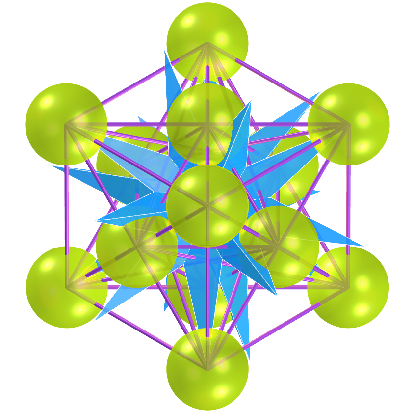</a>
    O Cubo de Metatron é um poderoso símbolo da Geometria Sagrada, pois acredita-se que este símbolo contém todos os padrões da criação. Um dodecaedro de pipas pode ser inscrito no símbolo Cubo de Metatron.
    

<h4>7. Dodecadodecaedro</h4>
<a href="../vr/Dodecadodecahedron.htm" target="_blank" title="modelo 3D" class="fotoA">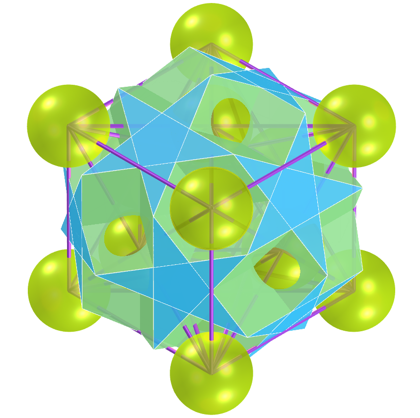</a>
    O Cubo de Metatron é o nome dado a uma figura geométrica bidimensional complexa feita com 13 círculos do mesmo tamanho, com linhas que se estendem do centro de cada círculo ao centro de todos os outros doze círculos. Um dodecadodecaedro pode ser circunscrito no símbolo Cubo de Metatron.
    

<h4>8. Sólido de Escher</h4>
<a href="../vr/Escher.htm" target="_blank" title="modelo 3D" class="fotoA">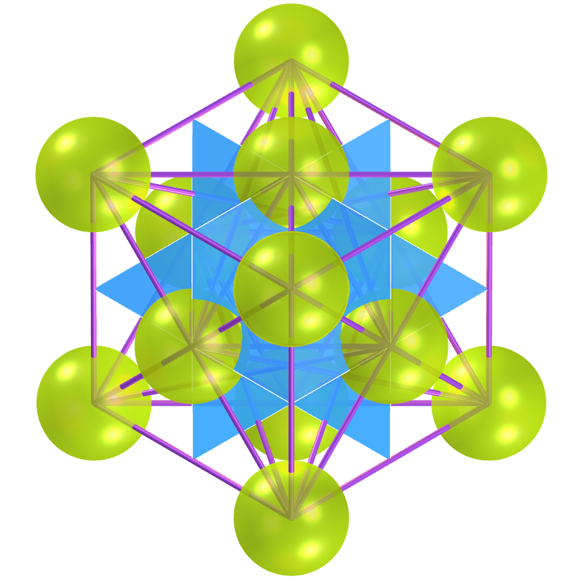</a>
    O Cubo de Metatron é considerado uma variante geométrica do símbolo do Fruto da Vida que é, por sua vez, derivado do símbolo da Flor da Vida. Um sólido de Escher pode ser inscrito no símbolo Cubo de Metatron.
    

<h4>9. Dual do sólido de Escher</h4>
<a href="../vr/EscherDual.htm" target="_blank" title="modelo 3D" class="fotoA">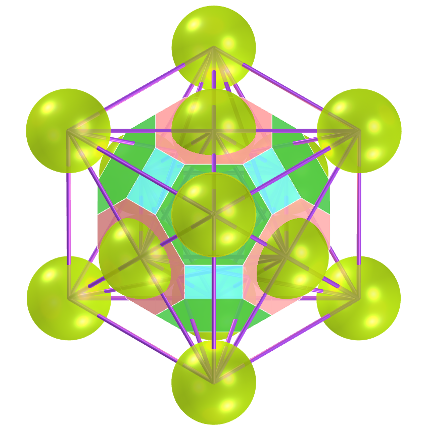</a>
    O Cubo de Metatron é um poderoso símbolo da Geometria Sagrada, pois acredita-se que este símbolo contém todos os padrões da criação. Um dual do sólido de Escher pode ser inscrito no símbolo Cubo de Metatron.
    

<h4>10. Grande cubicuboctaedro</h4>
<a href="../vr/GreatCubicuboctahedron.htm" target="_blank" title="modelo 3D" class="fotoA">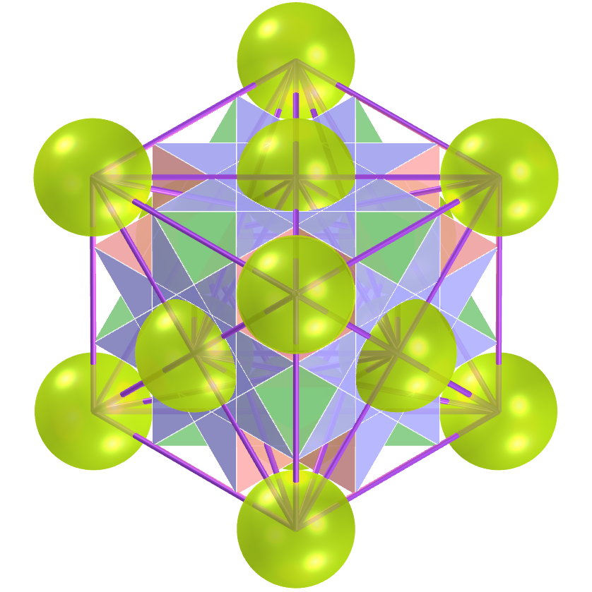</a>
    O Cubo de Metatron é o nome dado a uma figura geométrica bidimensional complexa feita com 13 círculos do mesmo tamanho, com linhas que se estendem do centro de cada círculo ao centro de todos os outros doze círculos. Um grande cubicuboctaedro pode ser inscrito no símbolo Cubo de Metatron.
    

<a href="#p1" class="topo">voltar ao topo</a>

<h4>11. Grande dirombicosidodecaedro</h4>
<a href="../vr/GreatDirhombicosidodecahedron.htm" target="_blank" title="modelo 3D" class="fotoA">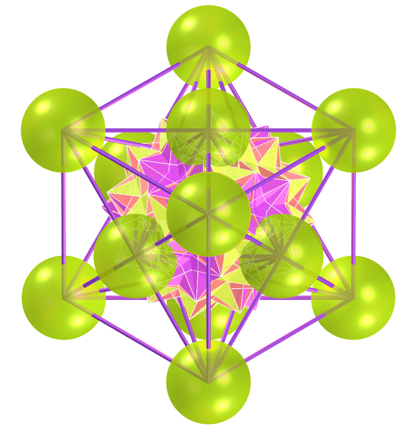</a>
    O Cubo de Metatron é considerado uma variante geométrica do símbolo do Fruto da Vida que é, por sua vez, derivado do símbolo da Flor da Vida. Um grande dirombicosidodecaedro pode ser inscrito no símbolo Cubo de Metatron.
    

<h4>12. Grande dodecaedro disdiakis</h4>
<a href="../vr/GreatDisdyakisDodecahedron.htm" target="_blank" title="modelo 3D" class="fotoA">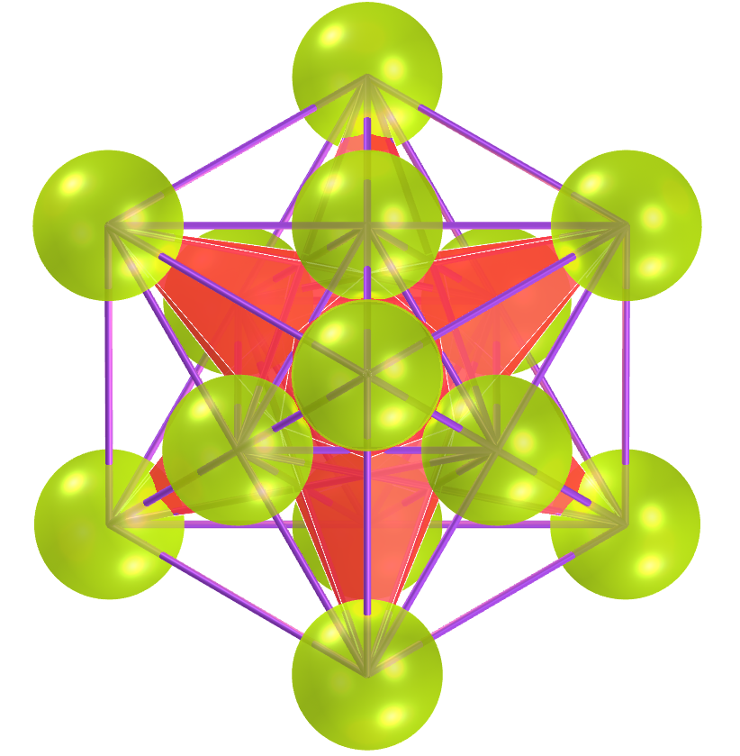</a>
    O Cubo de Metatron é um poderoso símbolo da Geometria Sagrada, pois acredita-se que este símbolo contém todos os padrões da criação. Um grande dodecaedro disdiakis pode ser inscrito no símbolo Cubo de Metatron.
    

<h4>13. Grande dodecicosidodecaedro ditrigonal</h4>
<a href="../vr/GreatDitrigonalDodecicosidodecahedron.htm" target="_blank" title="modelo 3D" class="fotoA">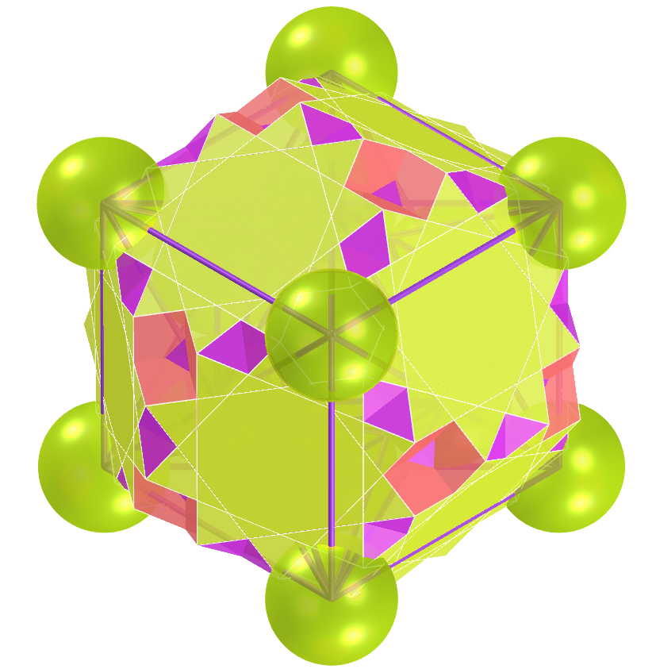</a>
    O Cubo de Metatron é o nome dado a uma figura geométrica bidimensional complexa feita com 13 círculos do mesmo tamanho, com linhas que se estendem do centro de cada círculo ao centro de todos os outros doze círculos. Um grande dodecicosidodecaedro ditrigonal pode ser inscrito no símbolo Cubo de Metatron.
    

<h4>14. Grande icosidodecaedro ditrigonal</h4>
<a href="../vr/GreatDitrigonalIcosidodecahedron.htm" target="_blank" title="modelo 3D" class="fotoA">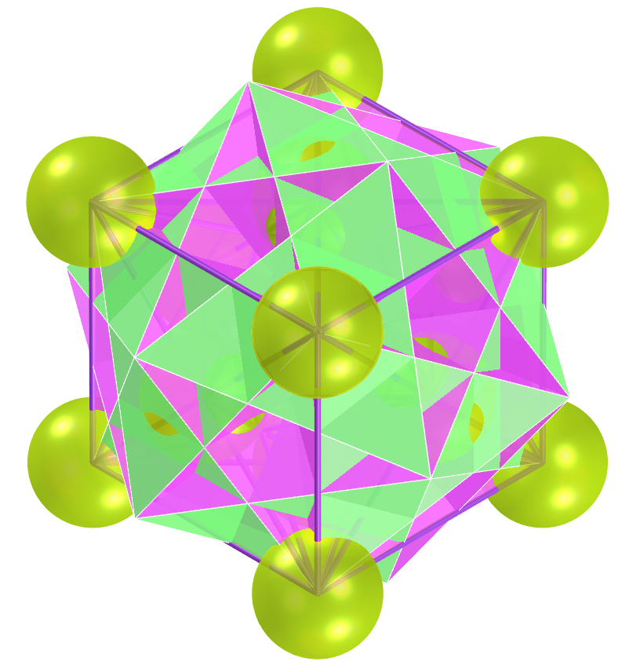</a>
    O Cubo de Metatron é considerado uma variante geométrica do símbolo do Fruto da Vida que é, por sua vez, derivado do símbolo da Flor da Vida. Um grande icosidodecaedro ditrigonal pode ser inscrito no símbolo Cubo de Metatron.
    

<h4>15. Grande dodecaedro</h4>
<a href="../vr/GreatDodecahedron.htm" target="_blank" title="modelo 3D" class="fotoA">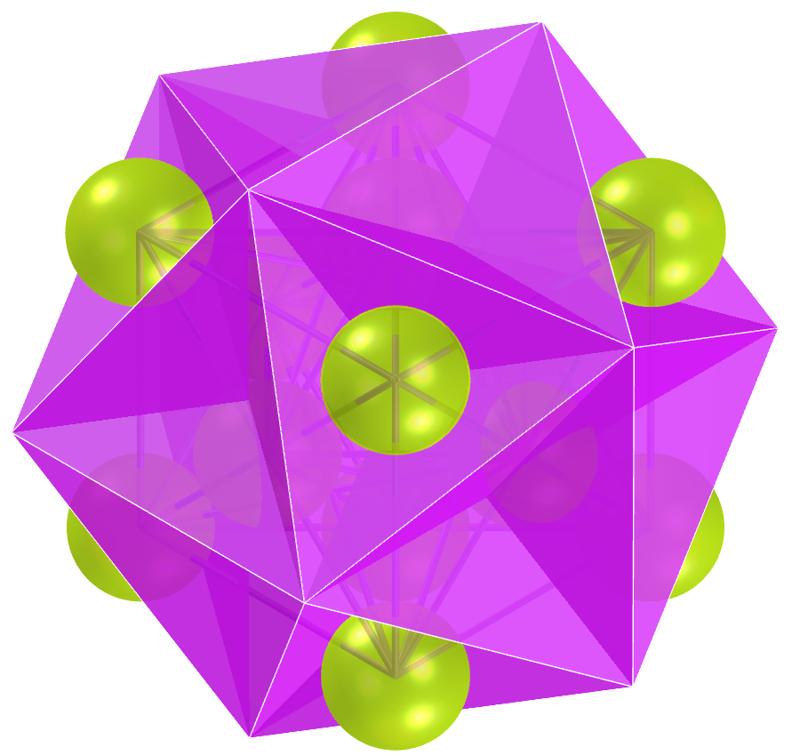</a>
    O Cubo de Metatron é um poderoso símbolo da Geometria Sagrada, pois acredita-se que este símbolo contém todos os padrões da criação. Um grande dodecaedro pode ser inscrito no símbolo Cubo de Metatron.
    

<h4>16. Grande dodecahemicosaedro</h4>
<a href="../vr/GreatDodecahemicosahedron.htm" target="_blank" title="modelo 3D" class="fotoA">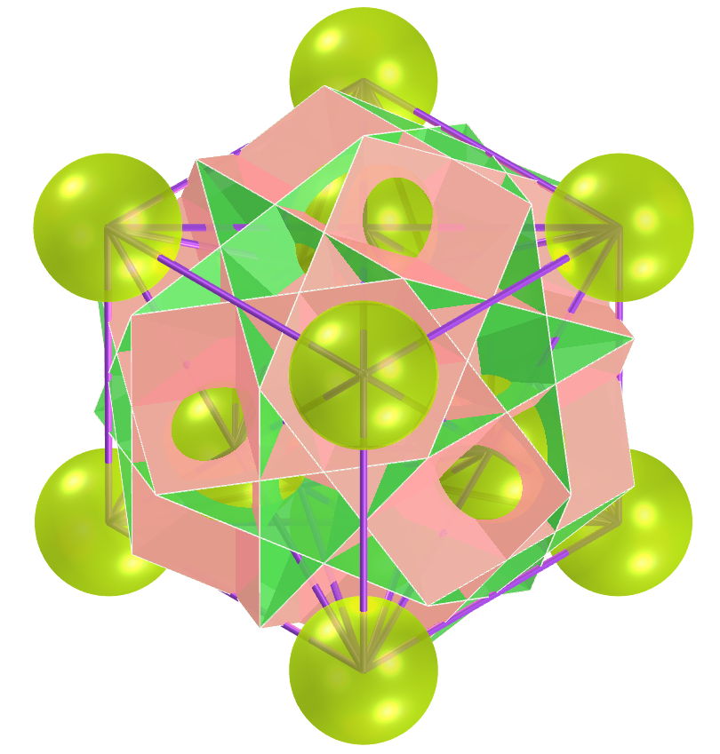</a>
    O Cubo de Metatron é o nome dado a uma figura geométrica bidimensional complexa feita com 13 círculos do mesmo tamanho, com linhas que se estendem do centro de cada círculo ao centro de todos os outros doze círculos. Um grande dodecahemicosaedro pode ser circunscrito no símbolo Cubo de Metatron.
    

<h4>17. Grande icositetraedro deltoidal</h4>
<a href="../vr/GreatDeltoidalIcositetrahedron.htm" target="_blank" title="modelo 3D" class="fotoA">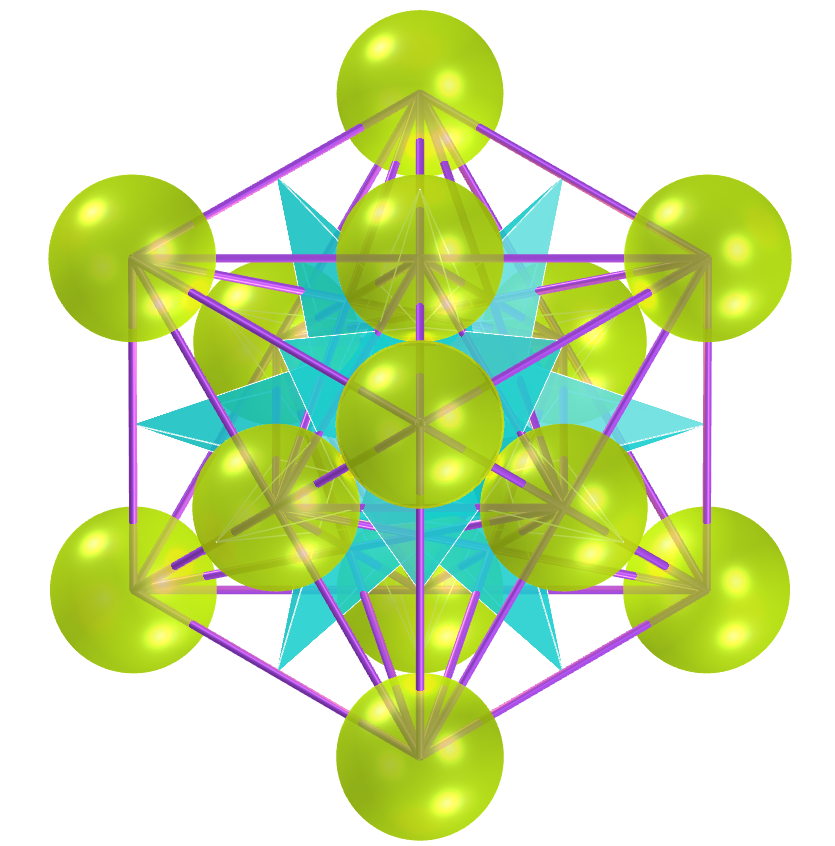</a>
    O Cubo de Metatron é o nome dado a uma figura geométrica bidimensional complexa feita com 13 círculos do mesmo tamanho, com linhas que se estendem do centro de cada círculo ao centro de todos os outros doze círculos. Um grande icositetraedro deltoidal pode ser inscrito no símbolo Cubo de Metatron.
    

<h4>18. Grande dodecicosaedro</h4>
<a href="../vr/GreatDodecicosahedron.htm" target="_blank" title="modelo 3D" class="fotoA">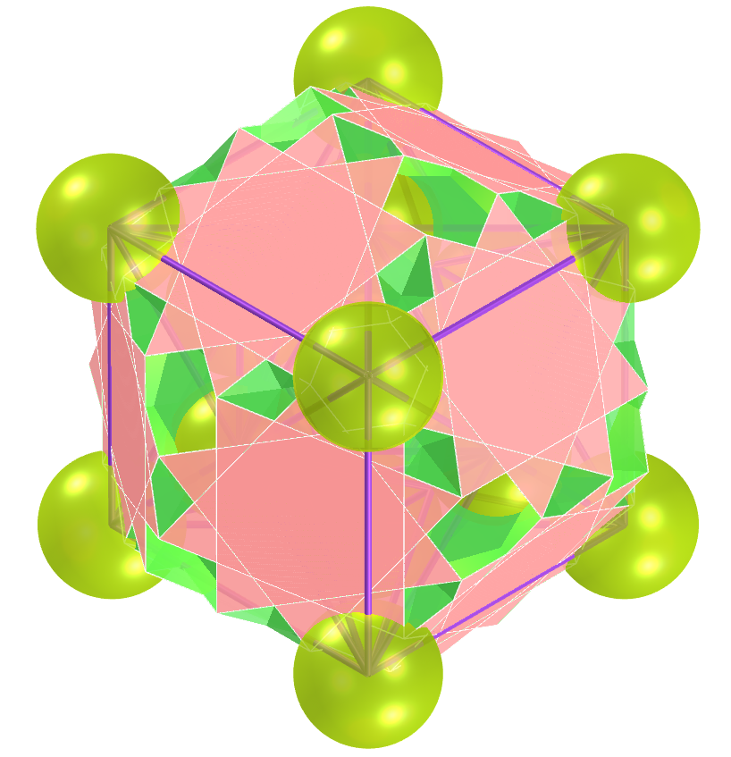</a>
    O Cubo de Metatron é considerado uma variante geométrica do símbolo do Fruto da Vida que é, por sua vez, derivado do símbolo da Flor da Vida. Um grande dodecicosaedro pode ser inscrito no símbolo Cubo de Metatron.
    

<h4>19. Grande icositetraedro hexacrônico</h4>
<a href="../vr/GreatHexacronicIcositetrahedron.htm" target="_blank" title="modelo 3D" class="fotoA">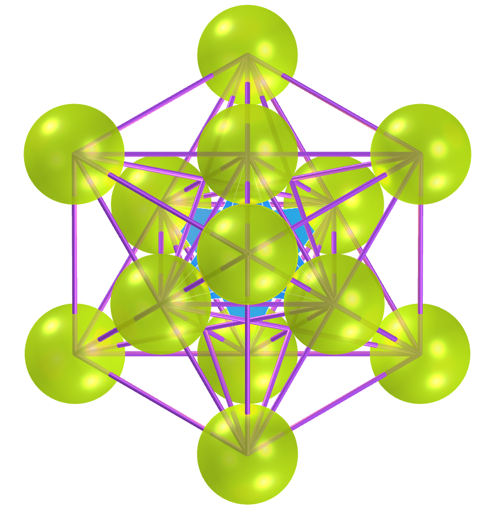</a>
    O Cubo de Metatron é um poderoso símbolo da Geometria Sagrada, pois acredita-se que este símbolo contém todos os padrões da criação. Um grande icositetraedro hexacrônico pode ser inscrito no símbolo Cubo de Metatron.
    

<h4>20. Grande rombihexacro</h4>
<a href="../vr/GreatRhombihexacron.htm" target="_blank" title="modelo 3D" class="fotoA">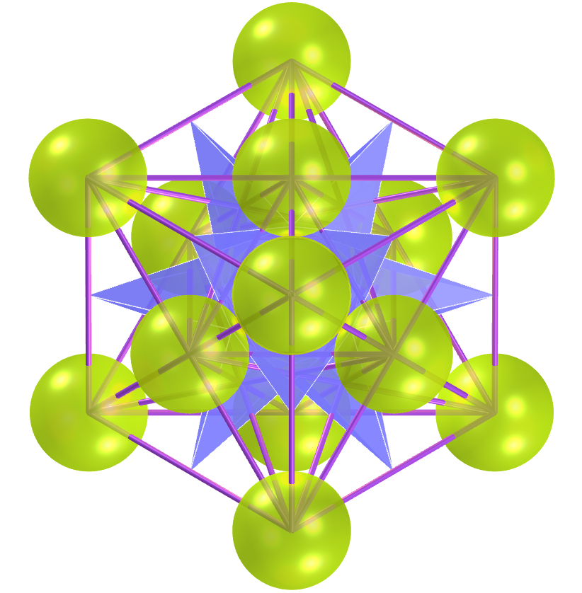</a>
    O Cubo de Metatron é o nome dado a uma figura geométrica bidimensional complexa feita com 13 círculos do mesmo tamanho, com linhas que se estendem do centro de cada círculo ao centro de todos os outros doze círculos. Um grande rombihexacro pode ser inscrito no símbolo Cubo de Metatron.
    

<a href="#p1" class="topo">voltar ao topo</a>

<h4>21. Grande rombihexaedro</h4>
<a href="../vr/GreatRhombihexahedron.htm" target="_blank" title="modelo 3D" class="fotoA">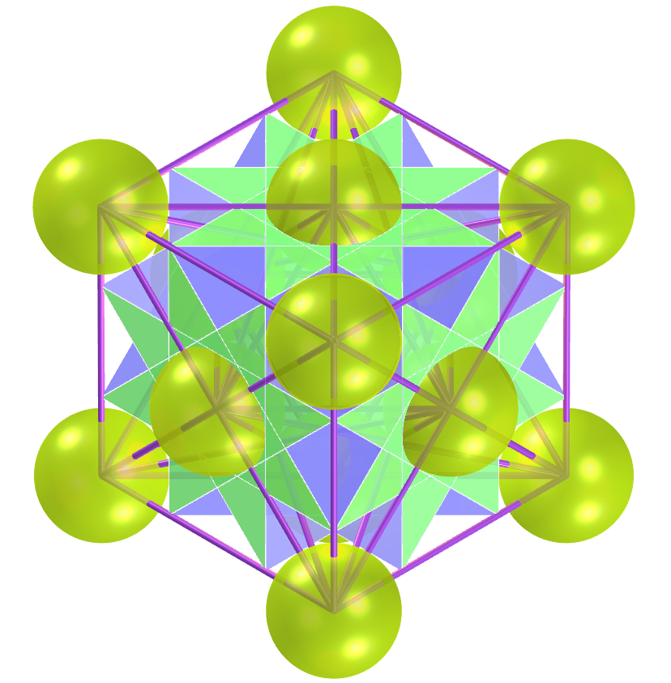</a>
    O Cubo de Metatron é o nome dado a uma figura geométrica bidimensional complexa feita com 13 círculos do mesmo tamanho, com linhas que se estendem do centro de cada círculo ao centro de todos os outros doze círculos. Um grande rombihexaedro pode ser inscrito no símbolo Cubo de Metatron.
    

<h4>22. Grande octaedro triakis</h4>
<a href="../vr/GreatTriakisOctahedron.htm" target="_blank" title="modelo 3D" class="fotoA">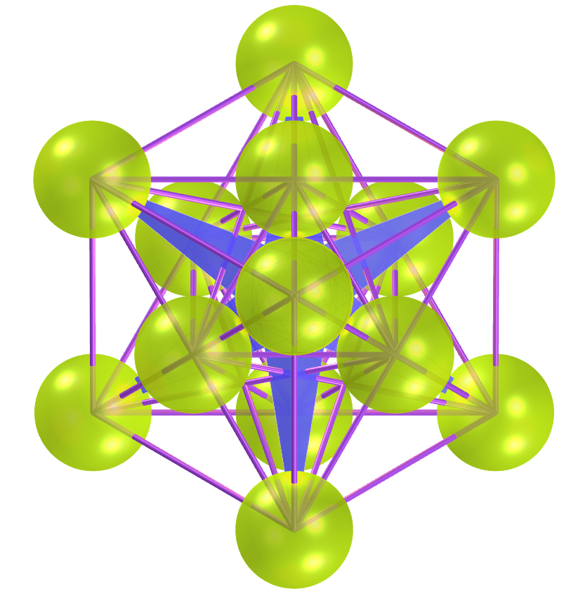</a>
    O Cubo de Metatron é considerado uma variante geométrica do símbolo do Fruto da Vida que é, por sua vez, derivado do símbolo da Flor da Vida. Um grande octaedro triakis pode ser inscrito no símbolo Cubo de Metatron.
    

<h4>23. Grande cuboctaedro truncado</h4>
<a href="../vr/GreatTruncatedCuboctahedron.htm" target="_blank" title="modelo 3D" class="fotoA">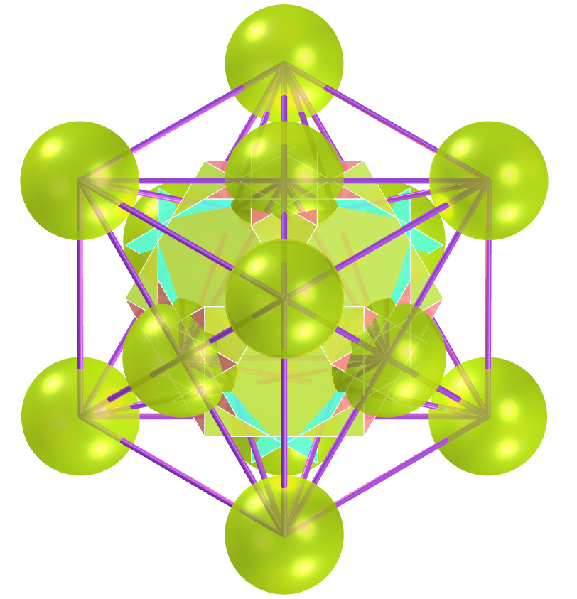</a>
    O Cubo de Metatron é um poderoso símbolo da Geometria Sagrada, pois acredita-se que este símbolo contém todos os padrões da criação. Um grande cuboctaedro truncado pode ser inscrito no símbolo Cubo de Metatron.
    

<h4>24. Tetraedro hexakis</h4>
<a href="../vr/HexakisTetrahedron1.htm" target="_blank" title="modelo 3D" class="fotoA">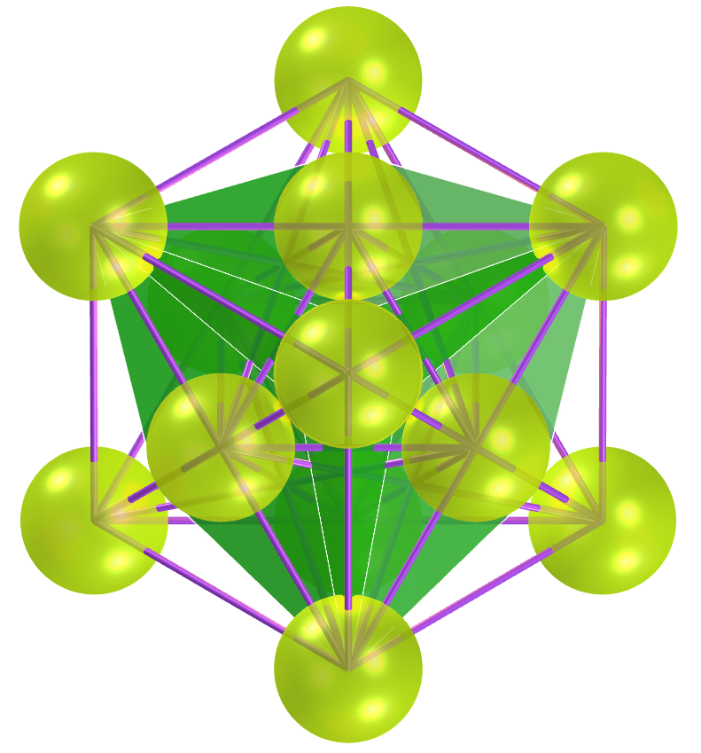</a>
    O Cubo de Metatron é o nome dado a uma figura geométrica bidimensional complexa feita com 13 círculos do mesmo tamanho, com linhas que se estendem do centro de cada círculo ao centro de todos os outros doze círculos. Um tetraedro hexakis pode ser inscrito no símbolo Cubo de Metatron.
    

<h4>25. Tetraedro hexakis estrelado</h4>
<a href="../vr/HexakisTetrahedron1Star.html" target="_blank" title="modelo 3D" class="fotoA">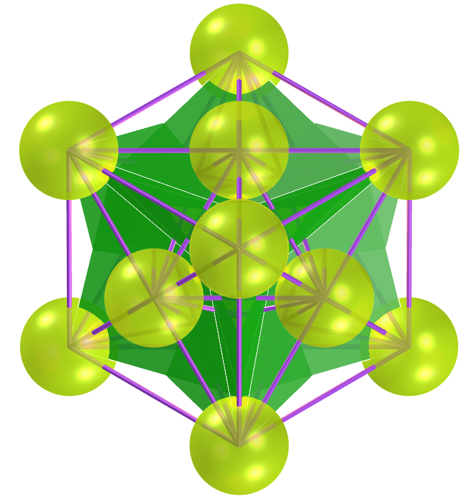</a>
    O Cubo de Metatron é considerado uma variante geométrica do símbolo do Fruto da Vida que é, por sua vez, derivado do símbolo da Flor da Vida. Um tetraedro hexakis estrelado pode ser inscrito no símbolo Cubo de Metatron.
    

<h4>26. Tetraedro hexakis</h4>
<a href="../vr/HexakisTetrahedron2.htm" target="_blank" title="modelo 3D" class="fotoA">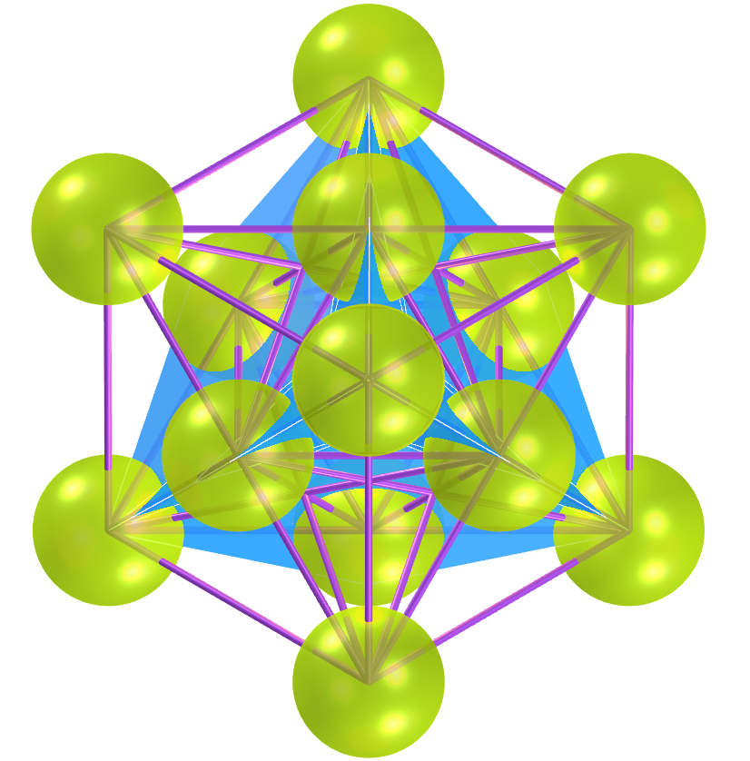</a>
    O Cubo de Metatron é um poderoso símbolo da Geometria Sagrada, pois acredita-se que este símbolo contém todos os padrões da criação. Um tetraedro hexakis pode ser inscrito no símbolo Cubo de Metatron.
    

<h4>27. Tetraedro hexakis estrelado</h4>
<a href="../vr/HexakisTetrahedron2Star.html" target="_blank" title="modelo 3D" class="fotoA">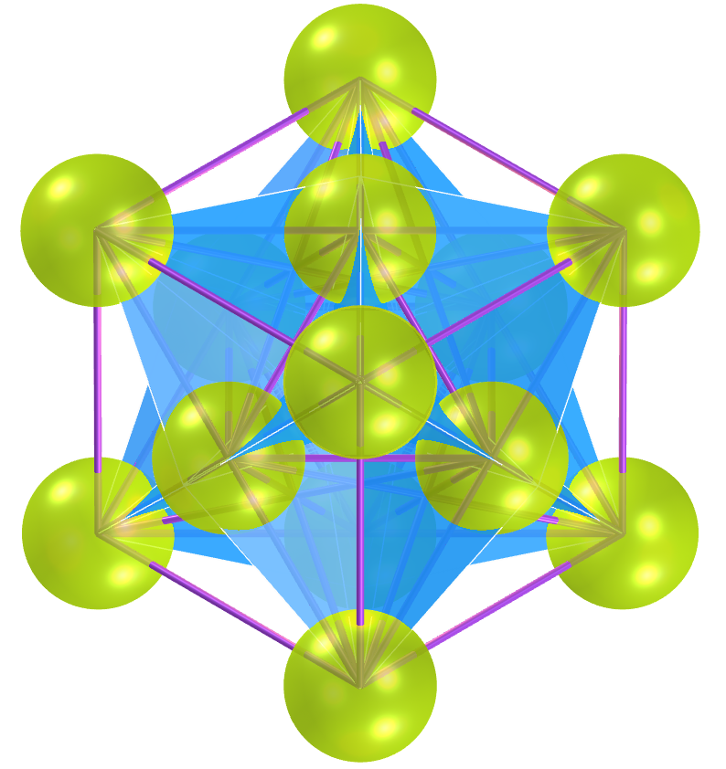</a>
    O Cubo de Metatron é o nome dado a uma figura geométrica bidimensional complexa feita com 13 círculos do mesmo tamanho, com linhas que se estendem do centro de cada círculo ao centro de todos os outros doze círculos. Um tetraedro hexakis estrelado pode ser circunscrito no símbolo Cubo de Metatron.
    

<h4>28. Tetraedro hexakis</h4>
<a href="../vr/HexakisTetrahedron3.htm" target="_blank" title="modelo 3D" class="fotoA">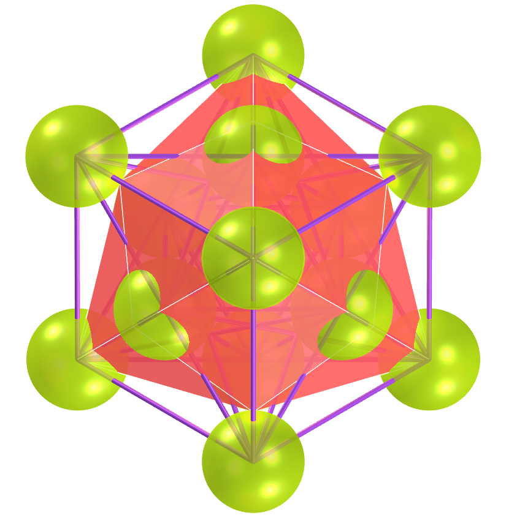</a>
    O Cubo de Metatron é considerado uma variante geométrica do símbolo do Fruto da Vida que é, por sua vez, derivado do símbolo da Flor da Vida. Um tetraedro hexakis pode ser inscrito no símbolo Cubo de Metatron.
    

<h4>29. Tetraedro hexakis estrelado</h4>
<a href="../vr/HexakisTetrahedron3Star.htm" target="_blank" title="modelo 3D" class="fotoA">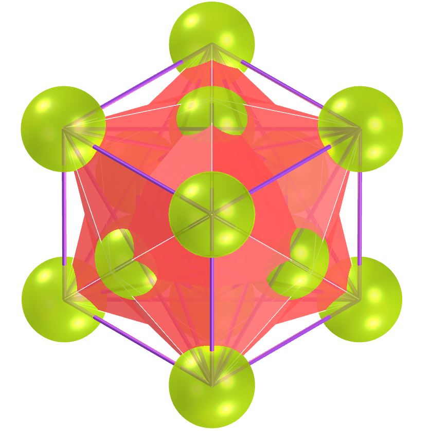</a>
    O Cubo de Metatron é um poderoso símbolo da Geometria Sagrada, pois acredita-se que este símbolo contém todos os padrões da criação. Um tetraedro hexakis estrelado pode ser inscrito no símbolo Cubo de Metatron.
    

<h4>30. Tetraedro hexakis</h4>
<a href="../vr/HexakisTetrahedron4.htm" target="_blank" title="modelo 3D" class="fotoA">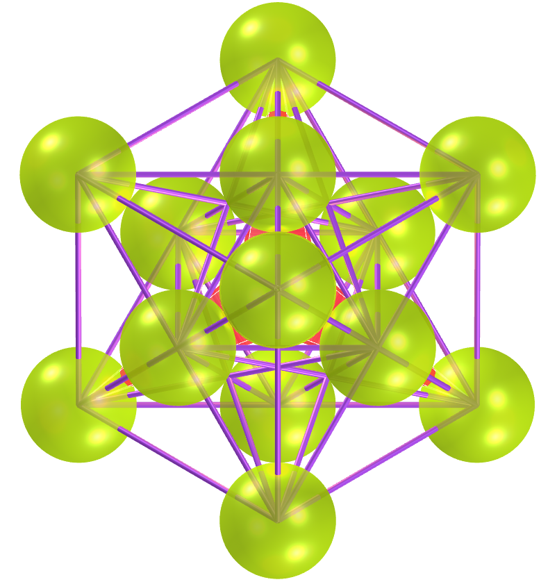</a>
    O Cubo de Metatron é o nome dado a uma figura geométrica bidimensional complexa feita com 13 círculos do mesmo tamanho, com linhas que se estendem do centro de cada círculo ao centro de todos os outros doze círculos. Um tetraedro hexakis pode ser inscrito no símbolo Cubo de Metatron.
    

<a href="#p1" class="topo">voltar ao topo</a>

<h4>31. Tetraedro hexakis estrelado</h4>
<a href="../vr/HexakisTetrahedron4Star.html" target="_blank" title="modelo 3D" class="fotoA">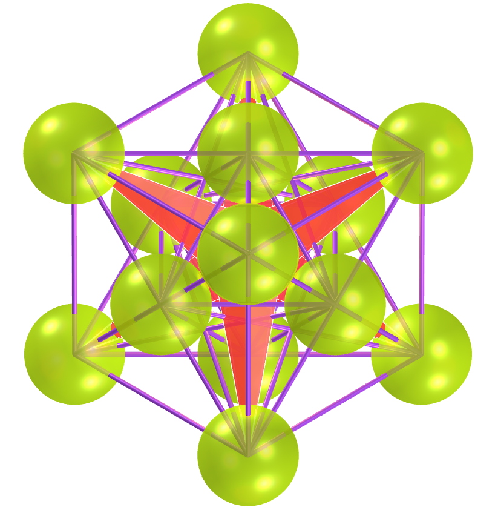</a>
    O Cubo de Metatron é o nome dado a uma figura geométrica bidimensional complexa feita com 13 círculos do mesmo tamanho, com linhas que se estendem do centro de cada círculo ao centro de todos os outros doze círculos. Um tetraedro hexakis estrelado pode ser inscrito no símbolo Cubo de Metatron.
    

<a href="#p1" class="topo">voltar ao topo</a>

  Metatron's cube and the nonconvex polyhedra 1: Visualization of symbols with Augmented Reality and Virtual Reality de <a xmlns:cc="http://creativecommons.org/ns#" href="https://paulohscwb.github.io/metatron/nonconvex/pt-br/" property="cc:attributionName" rel="cc:attributionURL">Paulo Henrique Siqueira</a> está licenciado com uma Licença <a rel="license" href="http://creativecommons.org/licenses/by-nc-nd/4.0/">Creative Commons Atribuição-NãoComercial-SemDerivações 4.0 Internacional</a>.

<h4>Como citar este trabalho:</h4> 

Siqueira, P.H., "Metatron's cube and the nonconvex polyhedra 1: Visualization of symbols with Augmented Reality and Virtual Reality". Disponível em: <https://paulohscwb.github.io/metatron/nonconvex/pt-br/>, Fevereiro de 2026.

<!---->
  <b>Referências:</b>
 Pardesco. "Sacred Geometry Art, Symbols & Meanings". <a href="https://pardesco.com/blogs/news/sacred-geometry-art-symbols-meanings" target="_blank">https://pardesco.com/blogs/news/sacred-geometry-art-symbols-meanings</a>
 Weisstein, Eric W. "Polyhedra" From MathWorld-A Wolfram Web Resource. <a href="https://mathworld.wolfram.com/topics/Polyhedra.html" target="_blank">https://mathworld.wolfram.com/topics/Polyhedra.html</a>
 Solar System Scope. "Solar Textures: Stars and Milky Way". <a href="http://dmccooey.com/polyhedra/" target="_blank">https://www.solarsystemscope.com/textures/</a>
