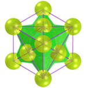
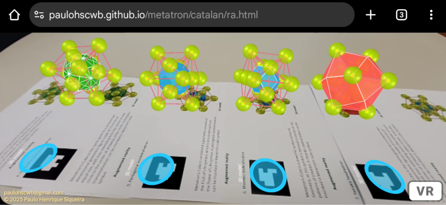

<link rel="stylesheet" href="../scripts/style.css">
<meta charset="utf-8">
<link rel="icon" type="image/png" href="../catalan/vr/salas/imagens/icone.png">
<h2>Visualização de poliedros no símbolo do Cubo de Metatron com Realidade Aumentada (RA) e Realidade Virtual (RV) em A-frame</h2>
<b>autor:</b> Paulo Henrique Siqueira - Universidade Federal do Paraná
 <b>contato:</b> <a href="#"> paulohscwb@gmail.com </a>
 <a href="https://paulohscwb.github.io/metatron/">english version</a>
  A Geometria Sagrada é considerada a linguagem do design universal do cosmos. Trata-se de uma ciência antiga que explora e explica os padrões de energia que servem para criar e unificar todas as coisas. 
 As estruturas matemáticas utilizadas na Geometria Sagrada podem ser encontradas nas artes, arquitetura e até em nosso DNA. Estas estruturas estão em toda parte, e servem de ligação entre o pensamento analítico e o lado intuitivo, ou então entre a ciência e a espiritualidade.
 O Cubo de Metatron é uma estrutura complexa da Geometria Sagrada, derivada da estrutura da Flor da Vida. Seu nome é uma homenagem ao Arcanjo Metatron. O símbolo Metatron aparece na tradição judaica, no islamismo e na tradição cristã. Este símbolo é considerado responsável por toda a criação e é considerado um Arcanjo, bem como um juiz.
 Este trabalho mostra alguns poliedros inscritos ou circunscritos no símbolo do Cubo do Metatron modelados em 2D e 3D, com as visualizações que podem ser acessadas com os recursos de Realidade Aumentada e também em salas imersivas de Realidade Virtual.

<h3 style="margin-top:3px"><a target="_blank" href="../catalan/pt-br/"> Poliedros de Catalan</a></h3>
<h3 style="margin-top:3px"><a target="_blank" href="../archimedes/pt-br/"> Poliedros de Arquimedes</a></h3>
<!--<h3 style="margin-top:3px"><a target="_blank" href="../biscribed/pt-br/"> Poliedros biscritos</a></h3>
<h3 style="margin-top:3px"><a target="_blank" href="../joined/pt-br/"> Cascos convexos de Arquimedes e de Catalan</a></h3>
<h3 style="margin-top:3px"><a target="_blank" href="../nonconvex/pt-br/"> Poliedros não convexos 1</a></h3>
<h3 style="margin-top:3px"><a target="_blank" href="../nonconvex/pt-br/"> Poliedros não convexos 2</a></h3>
<h3 style="margin-top:3px"><a target="_blank" href="../propellor/pt-br/"> Poliedros de hélice</a></h3>
<h3 style="margin-top:3px"><a target="_blank" href="../toroids/pt-br/"> Toroides poliédricos</a></h3>-->

<h3 align="center">Salas imersivas</h3>

<h3 align="center">Realidade Aumentada e modelos 3D</h3>

 Os ambientes de Realidade Aumentada foram criados com os scripts de <b>Jerome Etienne</b>: <a href="https://github.com/jeromeetienne/AR.js" target="_blank"> AR.js - Augmented Reality for the Web</a>.
 Os scripts de órbita desenvolvidos por <b>Kevin Ngo</b> foram usados nas páginas de Realidade Virtual dos modelos 3D: <a href="https://github.com/supermedium/superframe/tree/master/components/orbit-controls/" target="_blank"> Orbit controls for A-Frame</a>.
 As salas imersivas utilizam as propriedades físicas dos objetos 3D desenvolvidas por <b>Micah Blumberg</b>: <a  href="https://github.com/c-frame/aframe-physics-system" target="_blank"> Physics for A-Frame VR</a>
 Os controles de interação usados nas salas imersivas foram desenvolvidos por <b>Will Murphy</b>: <a  href="https://github.com/c-frame/aframe-super-hands-component" target="_blank"> Super Hands</a>
 

  Visualization of polyhedra in Metatron's cube symbol with Augmented Reality and Virtual Reality de <a xmlns:cc="http://creativecommons.org/ns#" href="https://paulohscwb.github.io/metatron/" property="cc:attributionName" rel="cc:attributionURL">Paulo Henrique Siqueira</a> está licenciado com uma Licença <a rel="license" href="http://creativecommons.org/licenses/by-nc-nd/4.0/">Creative Commons Atribuição-NãoComercial-SemDerivações 4.0 Internacional</a>.

<h4>Como citar este trabalho:</h4> 

Siqueira, P.H., "Visualization of polyhedra in Metatron's cube symbol with Augmented Reality and Virtual Reality". Disponível em: <https://paulohscwb.github.io/metatron/>, Março de 2025.

<!---->
 <b>Referências:</b>
 Pardesco. "Sacred Geometry Art, Symbols & Meanings". <a href="https://pardesco.com/blogs/news/sacred-geometry-art-symbols-meanings" target="_blank">https://pardesco.com/blogs/news/sacred-geometry-art-symbols-meanings</a>
 Weisstein, Eric W. "Polyhedra" From MathWorld-A Wolfram Web Resource. <a href="https://mathworld.wolfram.com/topics/Polyhedra.html" target="_blank">https://mathworld.wolfram.com/topics/Polyhedra.html</a>
 Solar System Scope. "Solar Textures: Stars and Milky Way". <a href="https://www.solarsystemscope.com/textures/" target="_blank">https://www.solarsystemscope.com/textures/</a>
 McCooey, D. I. "Visual Polyhedra". <a href="http://dmccooey.com/polyhedra/" target="_blank">http://dmccooey.com/polyhedra/</a>
